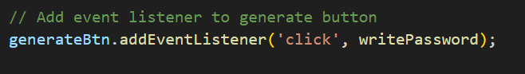
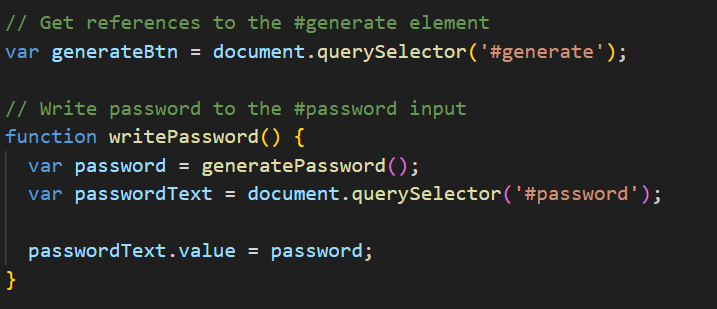

# Safekey-Generator-JS

## Description:
   
   Safekey-Generator-JS is an web application that user can use to generate a random password based on criteria they’ve selected. When user clicks "Generate Password" , user is displayed with series of prompts for password criteria as follows.
  *  Length of the password
      (Length should be 8 characters but no more than 128)
  *  Character types
      * Lowercase
      * Uppercase
      * Numeric
      * Special characters ($@%&*, etc)
  * Code validates for each input and at least one character type is selected.
  * Once prompts are answered then the password is generated and displayed in an alert and written to the page.

## Contents:
   * index.html
   * style CSS
   * script.js

    # HTML 
      index.html holds the basic structure of the application.
    # CSS
      style.css describes how the web elements used in index.html should be displayed in the web page.
    # Java Script
      Java Script adds interactivity to the HTML page, here script.js tells index.html how to behave when "Generate Password" button is clicked.
      
    

      The above code invokes the function writePassword.

     
     
     writePassword function displays generated password on the webpage(on HTML label element with id password)
     by invoking generatePassword function.

     

