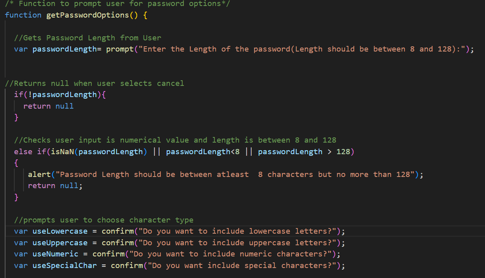
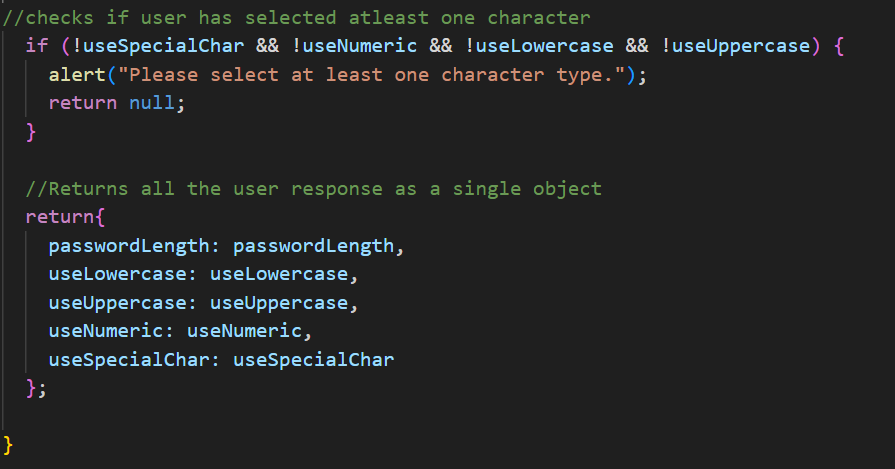
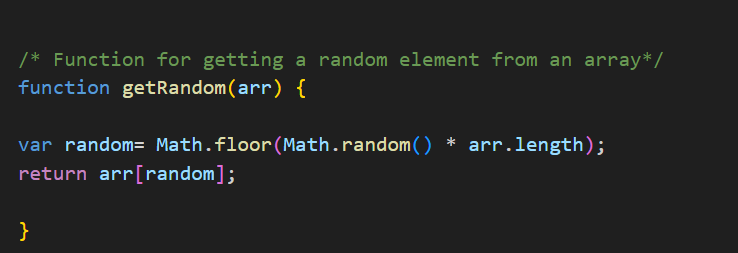
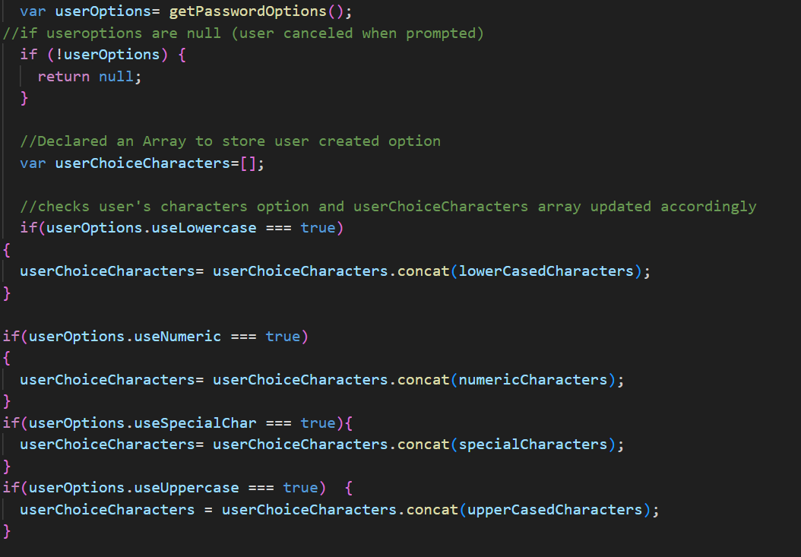
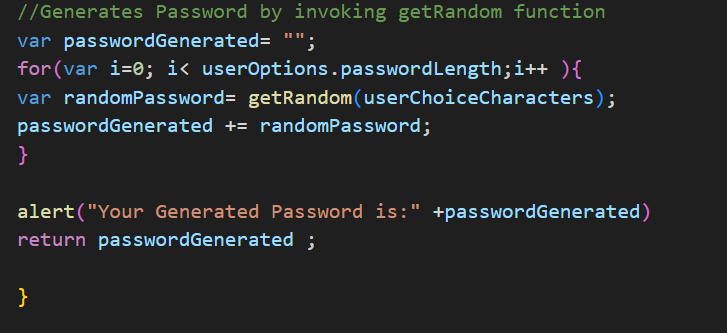
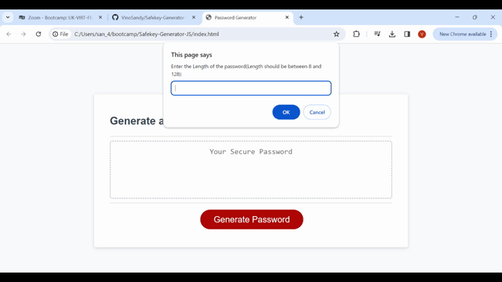

# Safekey-Generator-JS

## Description:
   
   Safekey-Generator-JS is an web application that user can use to generate a random password based on criteria they’ve selected. When user clicks "Generate Password" , user is displayed with series of prompts for password criteria as follows.
  *  Length of the password
      (Length should be 8 characters but no more than 128)
  *  Character types
      * Lowercase
      * Uppercase
      * Numeric
      * Special characters ($@%&*, etc)
  * Code validates for each input and at least one character type is selected.
  * Once prompts are answered then the password is generated and displayed in an alert and written to the page.

## Contents:
   * index.html
   * style CSS
   * script.js

 # HTML 
      index.html holds the basic structure of the application.
 # CSS
      style.css describes how the web elements used in index.html should be displayed in the web page.
 # Java Script
      Java Script adds interactivity to the HTML page, here script.js tells index.html how to behave when "Generate Password" button is clicked.
      

      The above code invokes the function writePassword.

     
     writePassword function displays generated password on the webpage(on HTML label element with id password)
     by invoking generatePassword function.
     
     function generatePassword invokes function getPasswordOptions();.

   Function getPasswordOptions prompts the user and get the length of the password to be generated and if length of the password is not with in the range alerts the user with "Password Length should be between atleast  8 characters but no more than 128" error message.

   Then prompts the user to get character options to be included in the password and sends an alert to include atleast 1 character when no character is choosen .
   When user gives option for Password Length and characters all the inputs are returned as an single obejct by the function.

  function getRandom(arr) finds the random element from the array when invoked using "Math.random object".

 

  Function generatePassword invokes getPasswordOption() function and checks with all characterset and stores all the user response in userChoiceCharacters array.
  

   
   Then getRandom function is invoked to get the random character from the userChoiceCharacters array and stores the random characters in var passwordGenerated as string. The for loop invoke the getRandom function to the number of times given by the user as passwordlenth.
   Then the generated password is alerted to user and written in the web password label.

# Demo1:

The above demo shows how password is generated as per users choice.

# Demo2:

The above demo covers all the negative secnario like when user selects cancel , user selects length not in the given range and user did not choose not one single character option.

  

  

